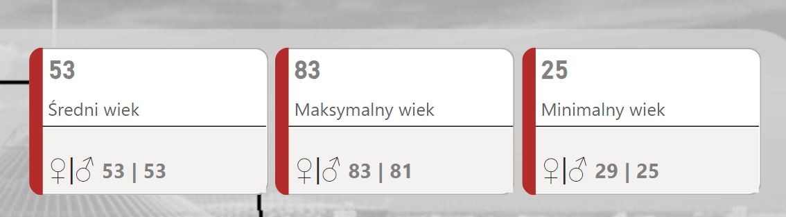
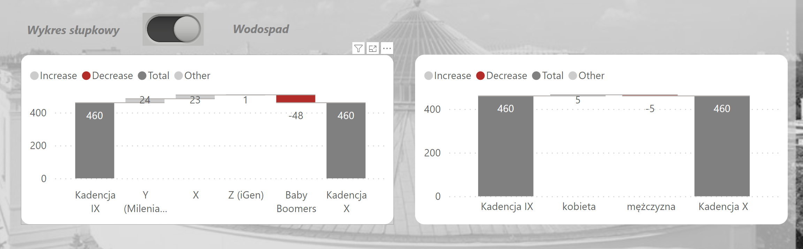

# README: Analysis of the Polish Sejm IX and X Term in Power BI

## Table of Contents
1. Introduction
2. Report Structure
3. Screenshot Descriptions
    - Home Page (Start)
    - Demographics of the Sejm IX/X Term
    - Job
    - Vote Distribution Sejm X
4. Usage Instructions
5. Final Notes

## 1. Introduction
This report has been created in Power BI to analyze the composition of the Polish Sejm during its IX and X terms. The report contains detailed information on the number of new politicians, the composition of political parties, demographics of MPs, and their professions. The data is visualized in a clear manner to facilitate easy interpretation and analysis. The data used in this report is sourced from official Sejm websites and was retrieved using web scraping techniques in Python.

## Dashboard Demo

## 2. Report Structure
The report is divided into the following sections:
- **Home Page (Start)**: Provides an overview of general information regarding the number of new politicians and the composition of political parties in the IX and X terms.
- **Demographics of the Sejm IX/X Term**: Presents detailed demographic data of MPs, such as age, gender, and generational affiliation.
- **Profession**: Information about the professions of MPs.
- **Vote Distribution Sejm X**: Analysis of the vote distribution in the Sejm X term.
- **Activities**: Data on the activities of MPs.

## 3. Pages Descriptions

### Home Page (Start)
- **Number of New Politicians in the X Term**: A semi-circular chart showing the number of new politicians (145) relative to the total number of MPs (460).
- **Political Parties IX/X Term**: A bar chart displaying the number of MPs from each party in the IX and X terms.
- **New vs. Unselected Politicians for the Next Term**: A chart showing the difference in the number of MPs in various parties between the IX and X terms.

### Demographics of the Sejm IX/X Term
- **Number of MPs IX/X Term by Generation**: A bar chart showing the number of MPs from different generations.
    - Baby Boomers, Generation X, Y (Millennials), Z (iGen)
- **Number of MPs IX/X Term by Gender**: A chart showing the number of men and women in the Sejm during the IX and X terms.
- **Data Table**: Contains information about MPs, including name, profession, electoral district, and date of birth.
- **Cards**: In the report, three interactive cards are presented to provide detailed insights into the age distribution of male and female MPs in selected parties. These cards are designed to give users an easy and intuitive way to explore demographic data.
  Below is a screenshot of each interactive card:
  
 - Click on a party name in the charts to filter the data.
 - The cards will automatically update to reflect the selected party's data, showing the average, maximum, and minimum ages of male and female MPs.
 - Use the interactive nature of the cards to compare age statistics across different parties and genders.
 - 
### Waterfall Charts
- **Waterfall Charts**: Used to explore the differences in demographic structures of various parties across different terms. These charts help in understanding the changes in the composition and demographics of the Sejm.
  Below is a screenshot of Waterfall Charts:
  
## 4. Usage Instructions
- **Navigation**: Use the menu on the left side to switch between different sections of the report.
- **Interactivity**: Clicking on different chart elements allows you to filter data by selected categories.
- **Detailed Information**: Hover over chart elements to see additional information in pop-up windows.

## 5. Final Notes
The report is intended to analyze the composition of the Polish Sejm and aims to provide valuable insights into the demographic and political changes between the IX and X terms. If you have any questions or suggestions regarding the report, please contact the author.

---
The report has been crafted with attention to data accuracy and visual presentation to allow users to easily analyze and interpret the presented information. The use of a navigation panel facilitates smooth transitions between different tabs of the report.
